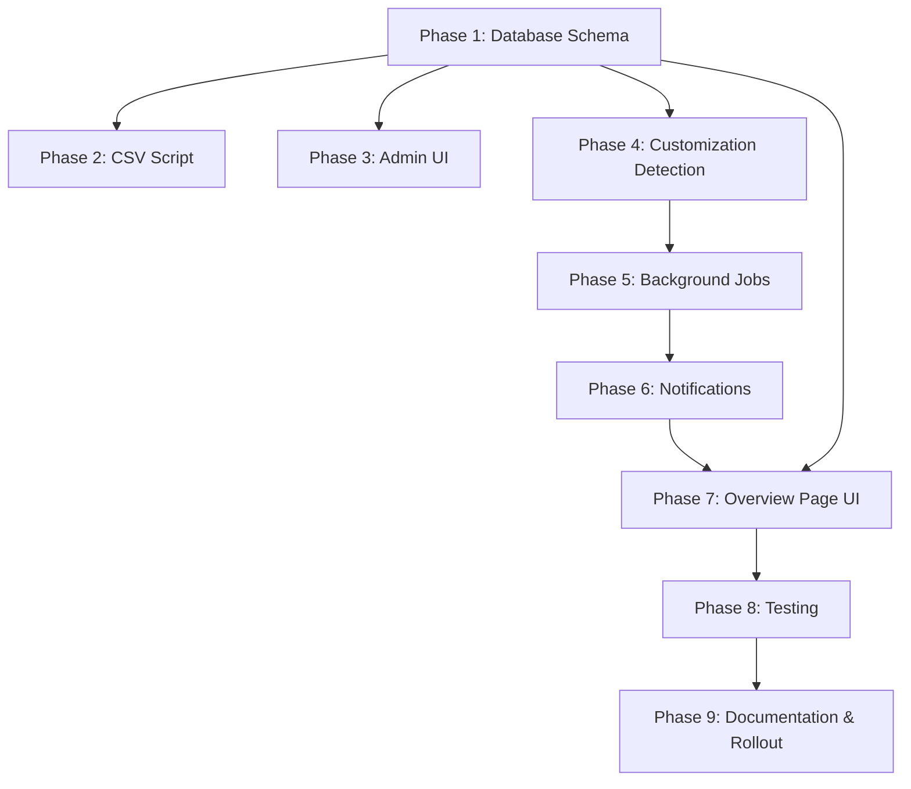

# Framework Update System - Implementation Guide

**Project**: CompAI Framework Template Update & Rollout System
**Status**: Planning Complete
**Est. Total Effort**: 8-10 weeks
**Last Updated**: 2025-11-07

---

## Executive Summary

This system allows CompAI (as software vendor) to update compliance framework templates (HIPAA, SOC 2, etc.) and automatically propagate changes to all organizations using those frameworks. It includes:

- ✅ Template versioning and change tracking
- ✅ Automated update detection and rollout
- ✅ Customization detection and conflict resolution
- ✅ Multi-channel notifications (email + in-app)
- ✅ Maintenance window scheduling
- ✅ Comprehensive admin UI for update management
- ✅ CSV-based bulk update tool

**Key Benefits**:
- Organizations stay current with latest regulatory guidance
- Customizations are preserved and conflicts are resolved gracefully
- Updates apply automatically during maintenance windows
- Full audit trail and rollback capabilities
- Platform admins have complete control over rollout

---

## Architecture Overview

```
┌─────────────────────────────────────────────────────────────────┐
│                      Platform Admin Layer                        │
│  ┌────────────────┐              ┌─────────────────────────┐   │
│  │  Admin UI      │              │  CSV Update Script      │   │
│  │  /platform-    │              │  ./scripts/update-      │   │
│  │   admin/*      │              │   framework.sh          │   │
│  └────────┬───────┘              └───────────┬─────────────┘   │
│           │                                   │                  │
│           └───────────────┬───────────────────┘                  │
└───────────────────────────┼──────────────────────────────────────┘
                            │
                            ▼
┌─────────────────────────────────────────────────────────────────┐
│                     Template Management                          │
│  ┌──────────────────────────────────────────────────────────┐  │
│  │  FrameworkEditorFramework (v1.1.0)                      │  │
│  │    ├─ ControlTemplates (50 controls)                    │  │
│  │    ├─ PolicyTemplates (10 policies)                     │  │
│  │    └─ TaskTemplates (15 tasks)                          │  │
│  └──────────────────────────────────────────────────────────┘  │
└───────────────────────────┬──────────────────────────────────────┘
                            │
                            ▼
┌─────────────────────────────────────────────────────────────────┐
│                   Update Campaign Layer                          │
│  ┌────────────────────────────────────────────────────────────┐ │
│  │  Campaign: HIPAA 1.0.0 → 1.1.0                           │ │
│  │    Status: in_progress                                    │ │
│  │    Affected Orgs: 150                                     │ │
│  │    ├─ Applied: 120                                        │ │
│  │    ├─ Conflicts: 25                                       │ │
│  │    ├─ Failed: 3                                           │ │
│  │    └─ Pending: 2                                          │ │
│  └────────────────────────────────────────────────────────────┘ │
└───────────────────────────┬──────────────────────────────────────┘
                            │
                            ▼
┌─────────────────────────────────────────────────────────────────┐
│                 Background Jobs (Trigger.dev)                    │
│  ┌──────────────┐  ┌──────────────┐  ┌──────────────────┐     │
│  │  Detector    │  │  Applier     │  │  Reminder        │     │
│  │  (Daily 2AM) │  │  (Hourly)    │  │  (Daily 10AM)    │     │
│  └──────┬───────┘  └──────┬───────┘  └──────┬───────────┘     │
│         │                 │                  │                   │
│         └─────────────────┼──────────────────┘                   │
└───────────────────────────┼──────────────────────────────────────┘
                            │
                            ▼
┌─────────────────────────────────────────────────────────────────┐
│              Organization Instance Layer (Per Org)               │
│  ┌────────────────────────────────────────────────────────────┐ │
│  │  Organization: Premier Care Pediatrics                    │ │
│  │    FrameworkInstance: HIPAA                               │ │
│  │      ├─ Controls (50) → [synced: 45, conflict: 5]        │ │
│  │      ├─ Policies (10) → [synced: 9, conflict: 1]         │ │
│  │      └─ Tasks (15)    → [synced: 15, conflict: 0]        │ │
│  │                                                            │ │
│  │    Maintenance Window: Sunday 2AM ET                      │ │
│  └────────────────────────────────────────────────────────────┘ │
└───────────────────────────┬──────────────────────────────────────┘
                            │
                            ▼
┌─────────────────────────────────────────────────────────────────┐
│                    Notification Layer (Novu)                     │
│  ┌──────────────────┐  ┌──────────────────┐  ┌──────────────┐ │
│  │  Update          │  │  Conflict        │  │  Reminder    │ │
│  │  Available       │  │  Review          │  │  (7+ days)   │ │
│  │  (7 days before) │  │  (Immediate)     │  │  (Daily)     │ │
│  └──────────────────┘  └──────────────────┘  └──────────────┘ │
│           │                      │                    │          │
│           └──────────────────────┼────────────────────┘          │
│                                  ▼                                │
│                    ┌──────────────────────────┐                  │
│                    │  Email + In-App Notif    │                  │
│                    └──────────────────────────┘                  │
└──────────────────────────────────────────────────────────────────┘
```

---

## Implementation Phases

### Phase Dependencies



### Phase Overview

| Phase | Description | Effort | Dependencies | Status |
|-------|-------------|--------|--------------|--------|
| [Phase 1](./phase1-database-schema.md) | Database Schema Updates | 1-2 weeks | None | Not Started |
| [Phase 2](./phase2-csv-update-script.md) | CSV Update Script System | 1-2 weeks | Phase 1 | Not Started |
| [Phase 3](./phase3-backend-admin-ui.md) | Backend Admin UI | 2-3 weeks | Phase 1 | Not Started |
| [Phase 4](./phase4-customization-detection.md) | Customization Detection | 1-2 weeks | Phase 1 | Not Started |
| [Phase 5](./phase5-background-jobs.md) | Background Jobs (Trigger.dev) | 1-2 weeks | Phases 1, 4 | Not Started |
| [Phase 6](./phase6-notification-system.md) | Notification System (Novu) | 1 week | Phases 1, 5 | Not Started |
| [Phase 7](./phase7-overview-page-ui.md) | Overview Page UI Updates | 1 week | Phases 1, 6 | Not Started |
| [Phase 8](./phase8-automated-testing.md) | Automated Testing | 1.5 weeks | All previous | Not Started |
| [Phase 9](./phase9-documentation-rollout.md) | Documentation & Rollout | 1 week | All previous | Not Started |

**Total Estimated Effort**: 8-10 weeks

---

## Quick Start

### For Implementation Team

1. **Start with Phase 1** (Database Schema)
   - Review schema changes
   - Run migrations in development
   - Backfill existing data

2. **Choose Update Method** (Phase 2 or 3)
   - **CSV Script**: For bulk updates, automation
   - **Admin UI**: For manual, visual management
   - *Recommendation*: Implement both (CSV first for MVP)

3. **Implement Core Logic** (Phase 4-5)
   - Customization detection algorithms
   - Background jobs for automated updates

4. **Add User Experience** (Phase 6-7)
   - Notifications
   - Overview page updates

5. **Test Thoroughly** (Phase 8)
   - Unit, integration, E2E tests
   - Performance testing

6. **Deploy Safely** (Phase 9)
   - Staged rollout
   - Monitor metrics

### For Platform Admins

After implementation complete:

1. **Review Admin Guide**: [Phase 9 - Admin Documentation](./phase9-documentation-rollout.md#admin-documentation)
2. **Access Admin UI**: `/platform-admin/frameworks`
3. **Prepare First Update**: Follow CSV or UI method
4. **Monitor Rollout**: Track campaign progress

### For Organization Users

After receiving update notification:

1. **Check Framework Updates Card**: On Overview page
2. **Review Changelog**: Click "View Changes"
3. **Resolve Conflicts** (if any): Navigate to conflict resolution UI
4. **Confirm Update**: Verify all items updated correctly

---

## Key Features

### 1. Template Versioning

- **Semantic Versioning**: major.minor.patch (e.g., 1.2.3)
- **Changelog**: Markdown changelog for each version
- **Published vs. Draft**: Only published versions trigger updates

### 2. Customization Detection

- **Field-Level Tracking**: Know exactly which fields were customized
- **Smart Conflict Detection**: Distinguish safe auto-apply vs. needs review
- **Detachment**: Permanently customize items if needed

### 3. Conflict Resolution

- **Three Strategies**:
  - **Accept**: Use template update (overwrite customization)
  - **Keep**: Preserve customization (ignore update)
  - **Detach**: Permanently break template link
- **Bulk Actions**: Resolve multiple conflicts at once
- **Visual Diff**: 3-column view (current, template, choice)

### 4. Scheduled Rollout

- **Maintenance Windows**: Updates apply only during configured windows
- **Staged Rollout**: Optional 5% → 25% → 100% gradual rollout
- **Per-Org Settings**: Each organization controls their window

### 5. Monitoring & Rollback

- **Real-Time Dashboard**: See progress across all organizations
- **Per-Org Drilldown**: View specific failures or conflicts
- **Rollback Capability**: Within 24 hours of update

### 6. Notifications

- **Multi-Channel**: Email + In-app (via Novu)
- **Lifecycle Notifications**:
  - Update Available (7 days before)
  - Conflicts Need Review (immediate)
  - Update Applied (confirmation)
  - Reminder (daily for unresolved)

---

## Technical Decisions

### Why Semantic Versioning?

Communicates impact clearly:
- **Patch**: Safe, bug fixes only
- **Minor**: New features, backwards compatible
- **Major**: Breaking changes

### Why Maintenance Windows?

Prevents disruption:
- Users aren't actively working
- Tasks won't be mid-completion
- Minimizes concurrent edit conflicts

### Why Soft Customization (vs. Hard Fork)?

Preserves vendor updates:
- Organizations get regulatory updates automatically
- Customizations are tracked, not lost
- Can re-sync with template later if desired

### Why Novu for Notifications?

Existing infrastructure:
- Already integrated in CompAI
- Multi-channel support
- User preferences
- Delivery tracking

### Why Trigger.dev for Jobs?

Reliability and observability:
- Retries and error handling
- Long-running job support (10 min)
- Built-in logging and monitoring
- Scheduled tasks (cron)

### Why Both CSV and UI?

Different use cases:
- **CSV**: Bulk updates, CI/CD, version control, automation
- **UI**: Small changes, visual feedback, less technical

---

## Data Flow Examples

### Example 1: Simple Update (No Conflicts)

```
1. Platform Admin publishes HIPAA v1.1.0
   └─ Changes: Updated 5 control descriptions

2. Detector Job (next day at 2 AM):
   └─ Finds updated framework
   └─ Creates Campaign (scheduled for Sunday 2 AM)
   └─ Sends "Update Available" notification to 150 orgs

3. Applier Job (Sunday 2 AM):
   For each org:
     └─ Check maintenance window ✓
     └─ Detect customizations → None found
     └─ Auto-apply all 5 updates
     └─ Send "Update Applied" notification

4. User sees confirmation on Overview page
   └─ "HIPAA updated to v1.1.0 - 5 changes applied"
```

### Example 2: Update with Conflicts

```
1. Platform Admin publishes HIPAA v1.1.0
   └─ Changes: Updated Control AC-1 description

2. Org "Premier Care" has customized AC-1:
   └─ Current: "MFA required for doctors only"
   └─ Template: "MFA required for all users"

3. Applier Job detects conflict:
   └─ Flags AC-1 as "conflict" status
   └─ Sends "Conflict Review" notification (high priority)

4. Org Admin reviews conflict:
   └─ Views 3-column diff
   └─ Chooses: "Accept Template Update"
   └─ Clicks "Apply Resolutions"

5. System applies resolution:
   └─ Updates AC-1 to template version
   └─ Marks as synced
   └─ Sends confirmation
```

---

## Success Metrics

### Operational Metrics

- **Update Success Rate**: Target >95%
- **Conflict Rate**: Target <10% (most updates auto-apply)
- **Average Resolution Time**: Target <48 hours
- **Rollback Rate**: Target <1%

### Performance Metrics

- **Detection Time**: <10 minutes for 10 frameworks
- **Application Time**: <60 seconds per organization
- **Notification Delivery**: >99% within 5 minutes

### User Experience Metrics

- **Admin Satisfaction**: Survey after first campaign
- **Support Ticket Volume**: Track framework-update-related tickets
- **Conflict Resolution Success**: % resolved without support help

### Business Metrics

- **Compliance Currency**: % of orgs on latest framework version
- **Customization Patterns**: Which controls/policies commonly customized
- **Adoption Rate**: % of orgs using auto-apply

---

## Risk Mitigation

### Risk: Data Loss During Update

**Mitigation**:
- All updates in database transactions (rollback on error)
- Preserve user-generated data (status, completion dates, assignees)
- Comprehensive test coverage (>90%)
- Staged rollout (catch issues early)

### Risk: Conflicting Updates (User Editing During Update)

**Mitigation**:
- Updates only during maintenance windows (low user activity)
- Optimistic locking (detect concurrent edits)
- Advisory locks during update (prevent conflicts)

### Risk: Notification Fatigue

**Mitigation**:
- Batch notifications (one per framework, not per item)
- User-configurable frequency
- Only notify on actionable items (conflicts)

### Risk: Rollout Failures at Scale

**Mitigation**:
- Staged rollout (5% → 25% → 100%)
- Per-org error isolation (one org failure doesn't block others)
- Retry logic with exponential backoff
- Monitoring and alerts

---

## Testing Strategy

### Unit Tests (90%+ Coverage)

- Customization detection logic
- Conflict resolution strategies
- Version comparison
- Changelog parsing

### Integration Tests

- Database transactions
- Template-to-instance sync
- Campaign lifecycle
- Notification triggers

### E2E Tests (Critical Paths)

- Admin: Create and monitor campaign
- User: Resolve conflicts
- Notifications: Delivery and read
- Rollback: Successful revert

### Performance Tests

- 1000 controls customization detection: <5s
- 100 orgs update application: <60s
- Large policy content comparison: <1s

---

## Gotchas & Solutions

### Gotcha #1: Tiptap JSON Comparison

**Problem**: Formatting changes flagged as content changes

**Solution**: Normalize JSON before comparison (strip whitespace, sort keys)

### Gotcha #2: Task Completion Data Loss

**Problem**: Updating task might reset completion status

**Solution**: Preserve `status`, `lastCompletedAt`, `reviewDate` fields

### Gotcha #3: Timezone Confusion

**Problem**: Maintenance windows in different timezones

**Solution**: Store timezone with window, use `date-fns-tz` for conversion

### Gotcha #4: Policy Signatures Invalidated

**Problem**: Updating policy content invalidates signatures

**Solution**: Flag for re-signature only on major content changes

### Gotcha #5: Evidence Links Broken

**Problem**: Replacing tasks breaks evidence attachments

**Solution**: Never change IDs, only update fields

---

## Rollback Procedures

### When to Rollback

- Data integrity issues (corruption, loss)
- Critical bugs affecting >10% of organizations
- Widespread user complaints

### Rollback Process

1. **Identify Campaign**:go to `/platform-admin/campaigns/[id]`
2. **Click "Rollback"** (within 24 hours only)
3. **Confirm** (requires executive approval in production)
4. **Monitor Rollback**: Creates reverse campaign
5. **Verify**: Check organizations reverted successfully
6. **Communicate**: Notify affected users

### Post-Rollback

- Document root cause
- Fix underlying issue
- Test fix in staging
- Re-attempt rollout when ready

---

## Support & Escalation

### Level 1: Organization Admin → CompAI Support

**Common Questions**:
- "How do I resolve conflicts?"
- "When will update apply?"
- "Can I delay the update?"

**Support Actions**:
- Check campaign status
- Verify maintenance window
- Guide through conflict resolution UI
- Escalate if technical issue

### Level 2: Support → Engineering

**Escalation Criteria**:
- Update failed for organization
- Conflict UI not working
- Notification not received

**Engineering Actions**:
- Check logs for errors
- Manually rerun update if safe
- Fix bugs and deploy hotfix

### Level 3: Engineering → Platform Admin

**Escalation Criteria**:
- Rollback required
- System-wide outage
- Data integrity compromise

**Platform Admin Actions**:
- Initiate rollback
- Pause rollout
- Executive communication

---

## Future Enhancements

### Phase 10: Advanced Conflict Resolution

- **AI-Assisted Merge**: Suggest best resolution based on change type
- **Side-by-Side Editor**: Edit both versions in split view
- **Change History**: Show diff from multiple versions

### Phase 11: Partial Rollouts

- **Organization Selection**: Choose specific orgs for update
- **Geography-Based**: Roll out by region
- **Framework Tier**: Premium customers get early access

### Phase 12: A/B Testing

- **Variant Testing**: Test two versions of a control
- **Feedback Collection**: Gather user feedback on changes
- **Data-Driven Decisions**: Roll out winner

### Phase 13: Collaborative Editing

- **Suggest Changes**: Orgs can suggest improvements to templates
- **Voting**: Popular suggestions bubble up
- **Credit System**: Recognition for contributors

---

## FAQ

**Q: Can organizations opt out of updates?**
A: No, updates ensure regulatory compliance. However, orgs can:
- Set maintenance window
- Disable auto-apply (require manual review)
- Customize items (with conflict resolution)

**Q: What if an organization is heavily customized?**
A: Customizations are preserved. Updates to customized items require manual review. Consider:
- Reviewing customizations periodically
- Accepting template updates if custom reason no longer valid
- Detaching items that should never sync

**Q: How long do I have to resolve conflicts?**
A: No hard deadline, but you'll receive reminders after 7 days. Unresolved conflicts may affect compliance reporting.

**Q: Can I preview updates before they apply?**
A: Yes! When notified of update, click "View Changes" to see full changelog before scheduled application.

**Q: What happens if I'm editing a control when update applies?**
A: Updates only occur during maintenance windows (low activity). If concurrent edit detected, update will retry next cycle.

---

## Resources

### Documentation

- **Admin Guide**: [Phase 9 - Admin Documentation](./phase9-documentation-rollout.md#admin-documentation)
- **User Guide**: [FRAMEWORK_ADMINISTRATOR_GUIDE.md](../../packages/db/data/user_documentation/FRAMEWORK_ADMINISTRATOR_GUIDE.md)
- **API Reference**: [To be created in implementation]

### Code References

- **Database Schema**: [apps/app/prisma/schema.prisma](../../apps/app/prisma/schema.prisma)
- **Customization Detection**: [apps/app/src/lib/framework-updates/detect-customizations.ts]
- **Background Jobs**: [apps/app/src/jobs/framework-update/]
- **Admin UI**: [apps/app/src/app/platform-admin/]

### External Resources

- [Trigger.dev Documentation](https://trigger.dev/docs)
- [Novu Documentation](https://docs.novu.co/)
- [Semantic Versioning](https://semver.org/)

---

## Contact

**Project Owner**: [Your Name]
**Engineering Lead**: [Lead Engineer]
**Product Manager**: [PM Name]

**Questions?** Reach out on Slack: #framework-updates

---

## Changelog

- **2025-11-07**: Initial planning documentation created
- **[Future]**: Implementation started
- **[Future]**: Phase 1 complete
- **[Future]**: Production deployment

---

**Status**: ✅ Planning Complete - Ready for Implementation

**Next Steps**:
1. Review and approve this plan
2. Allocate engineering resources
3. Begin Phase 1 (Database Schema)
